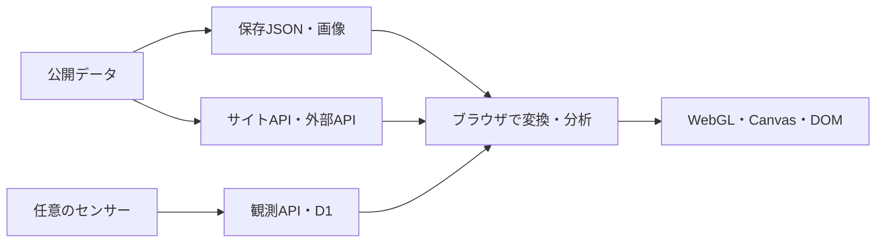

# ZEN Study プログラミングコンテスト2026 夏 — 審査ガイド

## 30秒で確認する

- 作品：**惑星の放課後 — GAIA SENSATION / GAIA SENSEWARE**
- [作品を開く](https://gaia-senseware.pages.dev/)
- [30秒で基本操作を覚える](https://gaia-senseware.pages.dev/#tour)
- [ソースコード](https://github.com/hinahina-vr/gaia-sensation)
- [公式要項](https://progedu.github.io/webappcontest/2026/summer/index.html)

通常の入口では言語と音の有無を選び、オープニング後に物語かデータ探索へ進みます。`#tour` は入口を迂回し、地図・年代・データの変換を3工程で案内します。一時停止、前後移動、途中終了もできます。

## 作品の要点

公開データを光・色・動き・音に変換し、出典と加工を確認しながら地球の変化をたどるブラウザ作品です。オンラインで共同制作してきた学生たちのヴィジュアルノベルを、データ展示と同じ世界につなげています。

| モード | 内容 |
|---|---|
| MAP | 世界16・日本55、計71展示。観測・統計・モデル値を可視化 |
| STORY | 本編6章、スタッフロール、解放後のAPEIRONCENE |
| SENSOR | 公開観測の閲覧、任意の端末・ESP32による参加 |
| CHARACTER | あめ・みず・saku・青猫の4者の資料と物語CG |
| SOUND | 12曲の音楽、星座・音反応の演出 |
| GX | 酸素と生命の歴史を扱う THE FIRST GX |
| ORBITAL | 保存済み宇宙データを使う10の観測窓 |
| CONCEPT | 作品の考え方と、講義から得た視点 |

日本語・英語・簡体字中国語に対応します。画像内の文字は翻訳対象外です。センサー登録・ログイン・AIを使わなくても基本体験を楽しめます。

## おすすめの確認順

1. [展示08](https://gaia-senseware.pages.dev/#world-08)で地図を移動・拡大し、観測点を選択。
2. 「展示メニュー」または前後ボタンで展示を変更。`#world-01`〜`#world-71` の直接URLにも対応。
3. スライダーや「統計分析」で値の推移・根拠を確認。スマホでは「読み方・凡例」「操作」を使用。
4. クルージングで展示を巡回。スライダー終端から3秒後、または地点を5秒ずつ最大5地点巡った後に次へ移動。
5. [物語](https://gaia-senseware.pages.dev/#story)でAUTO、LOG、SAVE／LOADなどを体験。

「自動表示」は現在の展示内の再生、「クルージング」は展示間の巡回です。読込・ガイド表示中などは進行を待ちます。

## 技術とデータ経路

HTML、CSS、JavaScript、WebGL 2、Canvas 2D、Web Audio APIを中心に構成しています。ブラウザへ外部JavaScriptランタイムライブラリを配信しない構成で、開発・検査ツールには依存パッケージを使用します。



| 展示 | 主なデータ |
|---|---|
| 01–05 | NASA FIRMS、Open-Meteo、USGSの火災・風・大気質・地震・雲 |
| 06–14 | CO₂、海流、森林、生態系、資源、人口等の保存データ。補助オーロラ層はNOAA SWPCから取得 |
| 15–20 | サイトAPI経由のOpen-Meteo／CAMSによる日本の気象・大気モデル値 |
| 21–30 | 人口移動、宿泊、住宅着工、気象の都道府県・代表観測点別系列 |
| 31–69 | 国内の水質、気象、大気汚染、PRTR、河川生物の年次・年度別保存データ |
| 70–71 | FAOと農林水産省の食料データ。旧・新方式と年度系列を区別 |

`LIVE CACHE` は取得値の再利用で、常時更新や現在の実測を保証しません。全球の02–05は5分のタブ内キャッシュ、01はサイト側で15分を基準にキャッシュします。`SAVED SNAPSHOT` は保存値・期限切れキャッシュ、02–05の `SAVED VALUES` は演出用サンプルを含みます。完全オフライン動作は保証しません。

`SOURCE`（公開記録）、`DERIVED`（計算・補間）、`SCENARIO`（仮定・操作）を区別します。欠測は0埋めせず、モデル値を観測所の実測として扱いません。詳しくは[取得状態の読み方](ARCHITECTURE.md#取得状態の読み方)と[データ出典](DATA_SOURCES.md)を参照してください。

## 制作素材

背景・キャラクター等の生成イラストはOpenAI ImageGen、音楽は主にSuno AIを使用しています。一部の音源はスクリプトによる合成です。地図にはNatural Earth等を使用しています。個別の出典は[素材・データ台帳](MEDIA_RIGHTS_LEDGER.md)、再利用条件は[利用条件](../LICENSE.md)を参照してください。

応募用の紹介画像：[横長JPEG](thumbnails/20260913/contest-wide.jpg) / [正方形JPEG](thumbnails/20260913/contest-square.jpg)。作品世界を表すイラストで、実画面のスクリーンショットではありません。

## ローカル起動

Node.js 20以上（CIは24）で、リポジトリのルートから実行します。

```sh
npm ci
node scripts/serve-novel-preview.mjs 4173
```

ブラウザで `http://127.0.0.1:4173/` を開きます。停止は `Ctrl+C`。静的プレビューにAPIキーは不要ですが、サイトAPI・センサー登録用のD1は動作しません。ライブ取得に失敗した場合の表示は展示によって異なります。

## 検証状況

検査コマンドは `npm run check`、`npm run check:contest`、`npm run check:rights` です。CI設定と実行結果はリポジトリのActionsで確認できます。コマンドの掲載は全項目合格を意味しません。

初期読込量の内部上限は **2 MB（2,000,000 bytes）** です。静的検査の未圧縮合計とChrome検査のencoded body合計を、`scripts/lib/contest-entry-budget.mjs` の共通上限と比較します。集計対象・圧縮によって両者の値は異なります。2 MBちょうどは許容し、1 byteでも超えれば失敗します。遅延読込・LCP・CLSなどの既存条件は維持しています。コンテストの公式容量制限ではありません。

2026-09-13の画面検証はローカルChromeのviewport設定で実施したものです。実機Safari・Firefox、実AI通信、全曲・全ストーリー・全周巡回、公開版の動作を網羅した検証ではありません。その後の変更もあるため、この結果を現在の全機能の合格として扱わないでください。

## 利用上の注意

AI分析は利用者のAPIキーで、確認後に指定先へデータを送信する任意機能です。[プライバシー](../PRIVACY.md)と[セキュリティ](../SECURITY.md)をご確認ください。可視化・AI回答は公式警報や安全上の判断には使用できません。

[公式要項](https://progedu.github.io/webappcontest/2026/summer/index.html)はGitHubリポジトリのPublic公開と、提出コード・公開サイトの動作一致を求めています。この案内は応募完了や公開版との一致を保証するものではありません。
