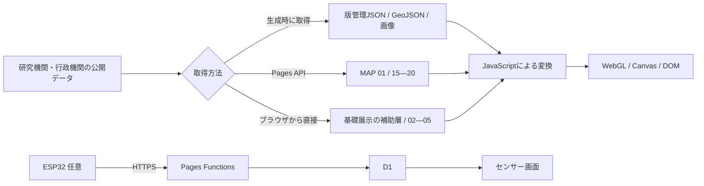

# ZEN Study プログラミングコンテスト2026 夏 — 審査ガイド

2026-09-13のソース構成を基準にした案内です。公開版との一致や、公式要項への適合・提出完了を示す文書ではありません。

## 30秒で確認する

- 作品: **惑星の放課後 — GAIA SENSATION / GAIA SENSEWARE**
- 応募予定区分: Webページ部門
- 公開サイト: <https://gaia-senseware.pages.dev/>
- 30秒ガイド: <https://gaia-senseware.pages.dev/#tour>
- GitHub: <https://github.com/hinahina-vr/gaia-senseware>
- 公式要項: <https://progedu.github.io/webappcontest/2026/summer/index.html>

`#tour` は映画的オープニングを迂回し、「30秒で基本操作を覚える」ガイドを開始します。10秒ずつ、地図を動かして観測点を選ぶ、年代を動かす、`SOURCE / DERIVED / SCENARIO` の変換過程を開く、という3工程を実画面で案内します。一時停止、前後移動、途中終了が可能です。

通常URLはサウンド設定とオープニングから始まり、最後に `物語をはじめる` と `データを探索する` の2つを提示します。再訪時も同じ入口を表示し、前回選んだルートへ自動遷移しません。

## 作品の要点

### 応募用サムネイル

2026-09-13制作の紹介用イラストです。実画面のスクリーンショットとは区別してください。

- 横長版: [JPEG](thumbnails/20260913/contest-wide.jpg) / [原寸PNG](thumbnails/20260913/originals/contest-wide.png)
- 正方形版: [JPEG](thumbnails/20260913/contest-square.jpg) / [原寸PNG](thumbnails/20260913/originals/contest-square.png)
- README用7枚を含む[素材一覧・生成記録](thumbnails/20260913/README.md)

応募フォームの指定サイズ・容量との適合やアップロードは未確認です。また、[公式応募規約](https://progedu.github.io/webappcontest/2026/summer/index.html)は提出GitHubリポジトリのPublic公開を求めています（2026-09-13確認）。非公開設定のまま提出しないよう、応募前に所有者の判断で確認してください。この画像制作では公開設定を変更していません。

### 体験と技術

公開データを鑑賞用の光・色・動き・音へ変換し、数値の出典と加工を確認しながら地球の変化をたどるブラウザ作品です。逗子海岸の展示会で初めて会う女子学生3人の物語、ESP32を使う参加型センサー、宇宙観測、キャラクター資料、音楽アーカイブも同じ世界に接続しています。

| モード | 審査時に確認できるもの |
|---|---|
| MAP | 71展示（世界16・日本55）。保存データ、国内統計、現在のモデル値、直近24時間の観測を同じ地図UIで比較 |
| STORY | 本編6章と、解放後のAPEIRONCENE 3章 |
| SENSOR | 端末・ESP32から参加する任意拡張。利用しなくても基本体験は完結 |
| CHARACTER | 雨宮 周・青野 瑞葉・木下 咲弥・青猫の4者の資料と物語CG |
| SOUND | 12曲と音に反応するビジュアライザー |
| GX | 酸素と生命の歴史を扱う `THE FIRST GX` |
| ORBITAL | 保存済み宇宙データを使う10の観測窓 |
| TOUR | 地図・年代・データ変換を案内する30秒ガイド |

基本体験はHTML、CSS、JavaScript、WebGL 2、Canvas 2D、Web Audio API、ブラウザ標準APIで動作します。ブラウザへ外部JavaScriptランタイムライブラリを配信しません。TypeScriptとWranglerは、参加型センサーとPages APIの開発・検査にだけ使用します。

参加型センサーのD1障害記録・負荷試算・復旧手順は[運用資料](SENSOR_OPERATIONS.md)、保存・公開・削除範囲は[プライバシー説明](../PRIVACY.md)、脆弱性報告と安全上の注意は[Security Policy](../SECURITY.md)に分けて公開しています。

## MAP 71展示とデータ経路

| 番号 | 内容 | データの状態 |
|---|---|---|
| 01 | NASA FIRMSの火災・熱異常 | Pages API経由。JSTの最新観測時刻と経過時間を表示し、失敗時は期限切れキャッシュまたは保存値へ切替 |
| 02—05 | 全球240サンプル点の風・気圧・大気質・雲量・日射と、全球の地震 | Open-MeteoとUSGSへブラウザから接続。JST時刻、経過時間、5分キャッシュ／演出用サンプルを区別 |
| 06—14 | CO₂、海流、森林・降水、資源化、排出・夜間光、地震、生態系、再生可能電力、人口 | 主に版管理スナップショット。基礎展示の補助オーロラ層はNOAA SWPC OVATIONを直接取得し、失敗時に保存値へ切替 |
| 15—20 | 風、CO₂、降水、気温、雲量、PM2.5 | Pages API経由のOpen-Meteo／CAMS。JSTのデータ時刻と取得状態を表示 |
| 21—30 | 人口移動、宿泊、住宅着工、気温3種、湿度、日照、降水、雨日数 | e-Stat／気象庁から生成した47都道府県スナップショット。閲覧時の外部API通信なし |
| 31—43 | 海・川・湖の水質、観測点の気象 | 同梱の国内観測スナップショット |
| 44—64 | 大気汚染、水質・汚濁物質 | 同梱の測定データ |
| 65—69 | PRTR排出・移動、河川の生物記録 | 同梱の届出・調査データ |
| 70—71 | 世界の食料需給・供給指標 | 同梱のFAO等のデータ |

番号は現行の表示番号です。旧資料の番号とは区別してください。主要ファイルの担当範囲は先頭の概要コメントと [README](../README.md#ソースコードの読み方) で確認できます。



公開版は閲覧中に外部APIへ接続します。`LIVE CACHE` は、MAP 01ではサイト側APIの取得値（サーバーで15分を基準にキャッシュ）、MAP 02—05では取得後5分以内のタブ内キャッシュを意味し、常時更新や現在の実測を保証しません。

取得失敗時は、展示ごとに過去の取得値・保存スナップショット・演出用サンプル・欠測を使い分けます。MAP 01の `SAVED SNAPSHOT` は期限切れAPIキャッシュも含みます。MAP 02—05の `SAVED VALUES` は過去の実測ではなく演出用サンプルです。完全オフライン動作の保証ではありません。[取得状態の読み方](ARCHITECTURE.md#取得状態の読み方)と画面のデータ時刻・経過時間を併せて確認してください。

## 現在の操作と拡張機能

- 展示ごとの直接URLは `#world-01`〜`#world-71`。例: [展示08](https://gaia-senseware.pages.dev/#world-08)。
- 「展示メニュー」で世界16・日本55を選択し、前後のボタンでも移動。PCではホバー／フォーカスでもメニューを開けます。
- クルージングはスライダー終端から3秒後、または地点を5秒ずつ最大5地点巡った後に次の展示へ進み、全展示をループします。
- 対応する展示の「統計分析」はブラウザ内で計算。AIへの質問は任意で、利用者のAPIキーと送信先の確認が必要です。
- タイトルの言語設定に応じて日本語・英語・簡体字中国語を表示。画像内の文字は翻訳対象外です。
- スマホは「読み方・凡例」「操作」を使用。低い画面では観測データを開閉式にして地図領域を確保します。
- `/concept/` に作品の考え方と講義からの学びを掲載しています。

## 審査時の確認項目

| 項目 | 確認方法 |
|---|---|
| 初見導線 | 通常URLでサウンド有無を選び、オープニング後の物語／データ探索を確認 |
| 再訪導線 | 再読込しても同じ入口から始まり、前回ルートへ自動遷移しないことを確認 |
| 直接URL | `#world-08`、`#tour`、`#story` はオープニングを迂回 |
| 地球観測 | `#tour` または「データを探索する」→「世界を観測する」 |
| 出典・変換 | 地図の出典ボタンと「統計分析」。スマホは「読み方・凡例」「操作」。詳細の `OPEN DATA`・`CODE` も参照 |
| ライブ時刻 | MAP 15—20・01—05のJSTデータ時刻・経過時間・取得状態を確認 |
| 国内統計 | MAP 21—30で47都道府県と時系列を切替 |
| 物語 | `#story` で本編を開始。AUTO、LOG、SAVE／LOAD、章送りを確認 |
| モバイル | Chromeの縦画面・短い横画面でサウンド設定、入口、地図、ガイドを操作 |
| GitHub・テスト | Actionsの `Contest checks` と下記コマンドを確認 |

## 実装と検査

入口ではキービジュアルとサウンド設定に必要な資産だけを読みます。MAP、STORY、GX、ORBITAL、SOUND、CHARACTER、TOURは操作後にモード単位で遅延読込します。音声、物語背景、観測JSONを初期表示時に一括転送しません。

```powershell
npm run check
npm run check:contest
npm run check:rights
npm --prefix sensor-platform run typecheck
npm --prefix sensor-platform run check:pages-worker
npm --prefix sensor-platform run test:pages
```

`check:contest` は初期画面の保守的な未圧縮合計1MB以下、操作前の大型資産読込禁止、公開メディアの権利台帳、この提出ガイド、CI設定を検査します。GitHub ActionsはUbuntu上の実Google Chromeで、PC、4種類のモバイル幅、WebGL無効、直接URL、履歴・再読込、モードの反復開閉、JavaScriptエラー、未処理Promise、404を検査し、失敗時成果物を14日間保存します。

## データの表示ルール

- `SOURCE` — 提供元が公開した観測・統計・モデル値
- `DERIVED` — 正規化、補間、集計、回帰、表示用の計算
- `SCENARIO` — 観客操作または明記した仮定による試算
- ライブ系はデータ時刻、取得時刻、経過時間、状態を分けて表示
- 欠測は0として扱わず、補完した箇所には `DERIVED` を付ける
- 未来投影は観測値と混ぜず、モデルの仮定・期間・限界を表示
- 火災の光点はNASA FIRMSの熱異常代表点であり、火災範囲や焼失面積ではない
- 地震の波紋は震度分布や被害範囲ではない
- 気象・大気質モデル値は公式警報や健康判断には使用しない

## データ出典

| 分野 | 主な提供元 | 作品内での用途 |
|---|---|---|
| CO₂・気温 | GOSAT / NIES、NOAA GML、NASA GISTEMP、CAMS、Open-Meteo | 全球CO₂、長期系列、気温偏差、現在のモデル値 |
| 海流・気象 | NOAA CoastWatch、NASA POWER、Open-Meteo Forecast | 海面流、風、降水、雲、日射 |
| 大気質 | Open-Meteo Air Quality / CAMS | PM2.5、エアロゾル光学的厚さ |
| 森林・夜間光 | NASA MODIS、NASA VIIRS | 森林域、夜間光 |
| 生物間関係・観察 | GloBI、GBIF | 花粉媒介関係、観察記録 |
| 資源・都市・エネルギー | UN SDG、Global Carbon Project / CICERO、World Bank | 再資源化、排出、都市人口、再生可能電力 |
| 国内統計 | e-Stat、総務省、観光庁、国土交通省、気象庁 | 人口移動、宿泊、住宅着工、気温・湿度・日照・降水 |
| 火災・地震 | NASA LANCE FIRMS、気象庁、USGS | 直近24時間の熱異常、国内震度履歴、世界の地震 |
| 宇宙 | NASA DONKI、NASA/JPL CNEOS、NASA Exoplanet Archive、ISAS/JAXA DARTS、NOAA SWPC | 太陽活動、小天体、系外惑星、リュウグウLIDAR、太陽風 |
| 文化 | UNESCO World Heritage Centre | 三つの生態系の文化例 |
| 地図 | Natural Earth 1:50m Land / Countries、国土地理院 | 世界地図、国境、都道府県境界 |

公式URL、取得日時、期間、単位、解像度、加工、ライセンス、帰属表示は作品内の `OPEN DATA` と[データ出典・ライセンス一覧](DATA_SOURCES.md)で確認できます。法的・運用上の詳細は[外部データ監査](EXTERNAL_DATA_USAGE_AUDIT.md)を正本とします。同監査の `要対応` 項目が残るため、全データを無条件に利用・再配布可能とは表明していません。

## 制作素材と権利表記

- 背景美術・キャラクター等のラスター素材: OpenAI ImageGenで制作。生成方法とハッシュは各 `*-RIGHTS.md` と台帳に記録。
- 音楽: オープニングテーマ『Planet Forecast - Hope』、エンディングテーマ『AfterSchool, AfterGlow』ほか、主にSuno AIで制作。作品内スタッフロールにも表示。
- 地図: Natural Earth 1:50m Land / Countries（Public Domain）。
- 科学・統計データ: 提供元の利用条件へリンクし、元の値と作品内変換を分けて表示。
- 機械可読台帳: `docs/media-rights-ledger.json`。人間向け: `docs/MEDIA_RIGHTS_LEDGER.md`。
- コードの利用条件: `LICENSE.md`。データとメディアはそれぞれの個別条件に従う。

## ローカル起動

Node.js 20以上（CIは24）。リポジトリのルートで `npm ci`、続けて `node scripts/serve-novel-preview.mjs 4173` を実行し、`http://127.0.0.1:4173/` を開きます。静的プレビューにAPIキーは不要ですが、Pages API・D1は動作しません。センサーの設定は [API導入資料](../sensor-platform/docs/PRODUCTION-SETUP.md) を参照してください。

センサー側の検査は先に `npm --prefix sensor-platform ci` が必要です。

## 検証状況

今回の文書更新で実行した提出準備チェックには停止項目があります。初期読込量、権利台帳の更新、テスト用ブラウザAPIの不足を[提出準備の確認結果](SUBMISSION_STATUS.md)に記録しました。以下の画面回帰の合格と、提出用の総合チェックの合格は別です。

2026-09-13のレスポンシブ修正では基準コミット `cb5e443` に対するローカル修正を確認しました。

- 18条件・378画面・通常導線180操作、個別回帰25件。
- 320×568〜2560×1440、900/901px境界、日本語・英語・簡体字中国語。
- 375×667で全71展示の操作領域、6系統でクルージング開始・停止と実時間進行、375×667 ↔ 1366×768の配置復帰。
- Chromeのviewport／タッチ設定、DPR 1、動きを抑える設定。実機Safari・Firefox・端末性能・公開版の合格を示すものではありません。
- 外部HTTPSを遮断し保存データを使用。センサーはローカルfixture API。実AI通信、全曲・全ストーリー、全周クルージング完走は対象外。
- 英語の凡例パネルに既存の日本語注意文が1文残ることを記録。

詳細はローカルの `artifacts/responsive-fixes-20260913/REPORT.html` と `manifest.json`。`artifacts/` は原則Git管理外のため、cloneだけでは証跡は付属しません。提出に必要な場合は別添資料として渡してください。後の概要コメント追記・文書更新は、この実機能の検証とは分けて扱います。掲載の全テストコマンドが提出版で合格したと表明するものではありません。

## GitHubと公開版の一致

提出コミットSHAと検証結果を記録し、公開サイトも提出する場合は同じ内容かを照合してください。未コミットのローカル変更はGitHubから取得できません。非公開リポジトリの場合は審査者の閲覧権限を確認してください。公開設定の変更・push・デプロイは、この文書更新では行いません。

APIキー、`.dev.vars`、端末トークン、個人情報、`node_modules/`、不要な作業ファイルを提出物に混ぜないでください。公式要項の最新内容と権利台帳の未解決事項も応募時に確認してください。権利台帳の整合テストは法的な許諾の代わりではありません。
